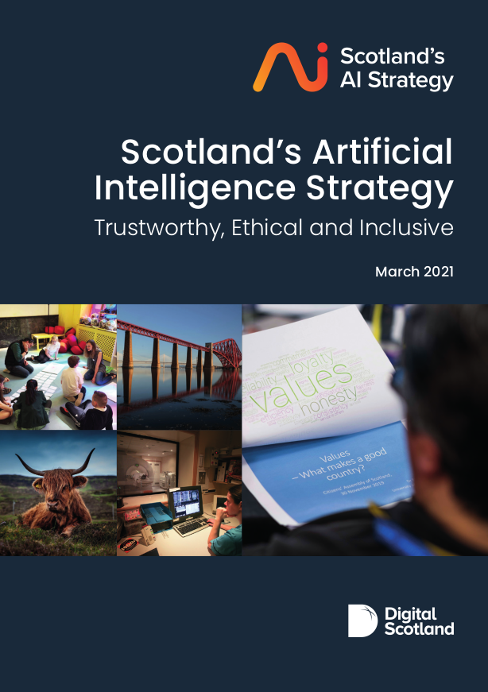
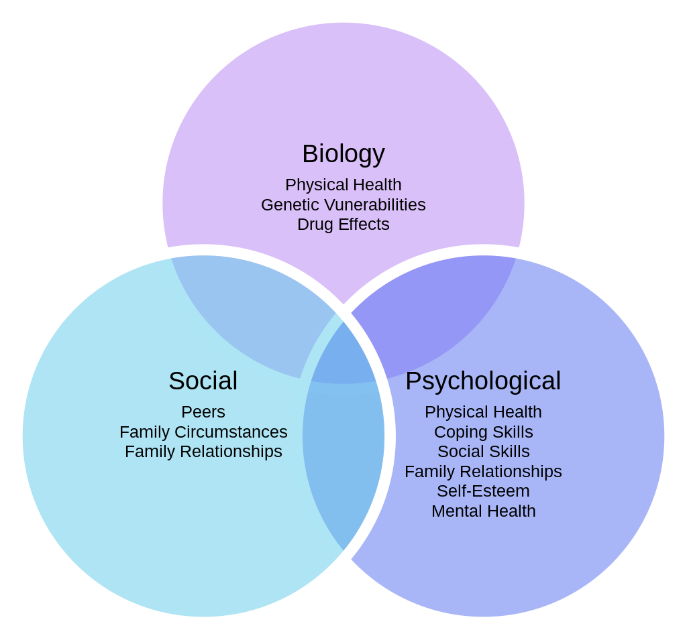
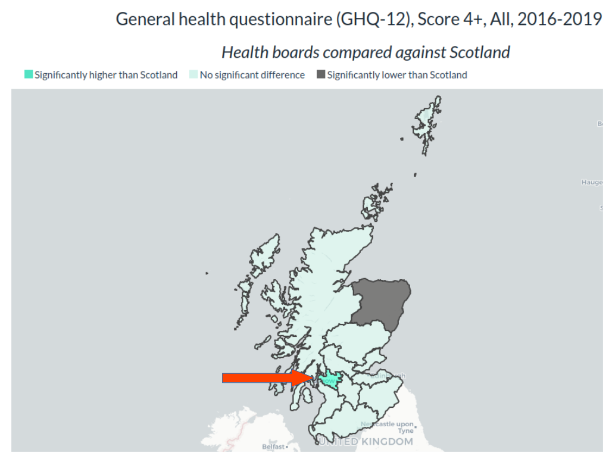
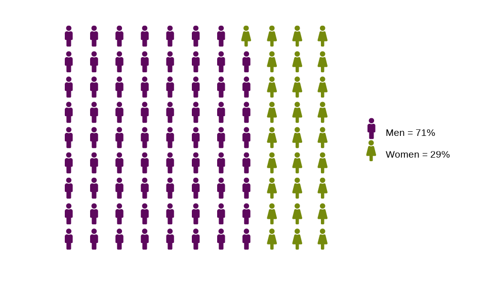
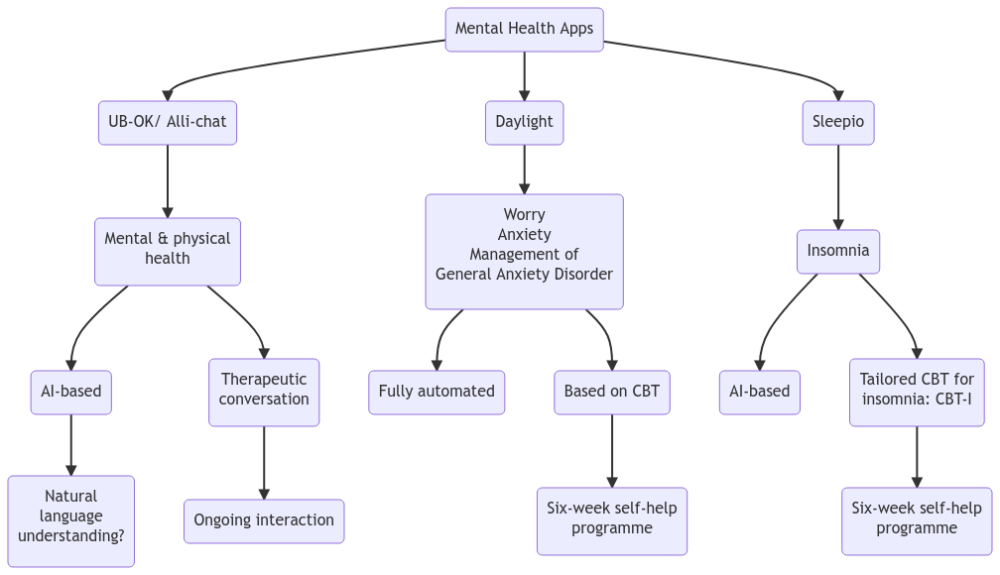
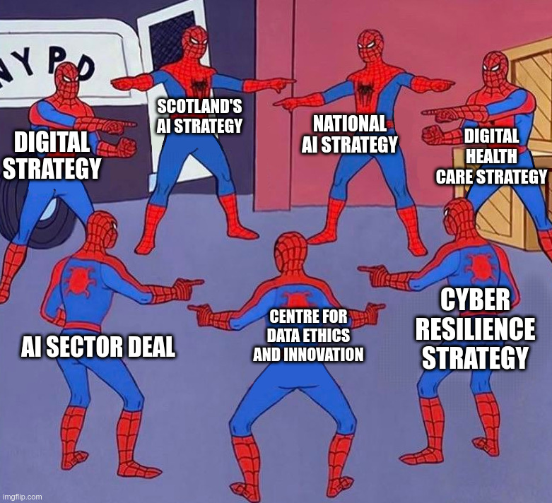

<style>

.section.sidebar {
  font-family: Roboto;
  font-size: 1rem;
}

.storyboard-nav .sbframelist ul li.active {
  font-family: Roboto;
  font-size: 1rem;
  font-weight: 600;
  background: #5D085D;
}

.storyboard-nav .sbframelist ul li:not(.active) {
  font-family: Roboto;
  font-size: 1rem;
}

.storyboard-nav .sbframelist ul li:hover {
  color: white;
  font-family: Roboto;
  font-size: 1rem;
  font-weight: 600;
  background: #758A0C;
}

.intro {
  font-size: 1.5rem;
}

p {
  font-family: Roboto;
  font-size: 1rem;
}

</style>

```{r setup, include=FALSE}
knitr::opts_chunk$set(echo = FALSE, message = FALSE)

# Load packages
library(tidyverse)
library(flexdashboard)
library(visNetwork)
library(readr)
library(ggplot2)
library(lubridate)
library(kableExtra)
library(plotly)
library(stringr)
library(DT)
library(DiagrammeR)
library(showtext)
library(waffle)
library(hrbrthemes)

font_add(family = "FontAwesome5Free-Solid", regular = "/home/chantel/R/x86_64-pc-linux-gnu-library/4.2/waffle/fonts/fa-solid-900.ttf")
font_add(family = "FontAwesome5Free-Regular", regular = "/home/chantel/R/x86_64-pc-linux-gnu-library/4.2/waffle/fonts/fa-regular-400.ttf")
font_add(family = "FontAwesome5Brands-Regular", regular = "/home/chantel/R/x86_64-pc-linux-gnu-library/4.2/waffle/fonts/fa-brands-400.ttf")

showtext_auto()

### MENTAL HEALTH IN SCOTLAND ###

# Create a data from showing 2020 data on suicide rate for men and women from https://www.scotpho.org.uk/health-wellbeing-and-disease/suicide/data/scottish-trends
suicides_chart <- data.frame(gender = factor(c("Men", "Women"),
                                       levels=c("Men", "Women")),
                             suicide_number = c(575, 230))

# Set scales (percentage) and labels
scalevalues <- sprintf("%.0f%%",
                       round(prop.table(suicides_chart$suicide_number)*100, 2))

# Create text labels for the two percentage values
customtext <- c(paste("Men", '=', scalevalues[1]),
                paste("Women", '=', scalevalues[2]))

suicide2020 <- ggplot(suicides_chart, aes(label = gender, 
                 values = suicide_number, 
                 color = gender)) +
  geom_pictogram(n_rows = 9, make_proportional = TRUE, size = 11) +
  scale_color_manual(
    name = NULL,
    values = c(
      `Men` = "#5D085D",
      Women = "#758A0C"),
    labels = customtext
  ) +
  scale_label_pictogram(
    name = NULL,
    values = c(
      `Men` = "male",
      Women = "female"), 
    labels = customtext) +
  coord_equal() +
  theme_ipsum_rc(grid="") +
  theme_enhance_waffle() +
  theme(legend.key.height = unit(2.25, "line")) +
  theme(legend.text = element_text(size = 10, hjust = 0, vjust = 0.75))

### TIMELINE CREATION ###
# Adapted from https://benalexkeen.com/creating-a-timeline-graphic-using-r-and-ggplot2/
# For Shiny https://www.r-bloggers.com/2019/06/interactive-network-visualization-with-r/

# Create a dataframe
timeline <- data.frame(Year = c(rep(c(2019), times = 2),
                                rep(c(2020), times = 3),
                                rep(c(2021), times = 6),
                                rep(c(2022), times = 4)),
                       Months = c(10, 11, 9, 9, 11, 3, 6, 7, 7, 9, 11, 2, 2, 3, 7),
                       Days = c(30, 27, 7, 8, 3, 22, 30, 5, 7, 5, 12, 1, 11, 30, 18),
                       Milestones = c("Steering Committee Workshop 1",
                                      "Steering Committee workshop 2",
                                      "The AI Of The Possible: Developing Scotland’s Artificial Intelligence (AI) Strategy",
                                      "The AI of The Possible: Developing Scotland’s Artificial Intelligence (AI) Strategy, Public Engagement Report",
                                      "Key findings from the Working Group discussions",
                                      "Scotland’s AI Strategy",
                                      "First 100 Days",
                                      "AI Alliance Engagement Workshop",
                                      "The Scottish AI Strategy & Playbook Sessions Report",
                                      "The Scottish AI Playbook Personas Workshop Report",
                                      "Scottish AI Playbook: User requirements mapping summary report",
                                      "Ensuring Full Participation in the Delivery of Scotland’s AI Strategy",
                                      "Digital, Data and AI Skills sector in Scotland",
                                      "State of AI Report",
                                      "Develop ethical and regulatory frameworks for AI in Scotland"),
                       Milestones_abbrev = c("Steering Committee Workshop 1",
                                      "Steering Committee workshop 2",
                                      "The AI Of The Possible",
                                      "The AI of The Possible 2",
                                      "Working Group Discussions",
                                      "Scotland’s AI Strategy",
                                      "First 100 Days",
                                      "AI Alliance Engagement Workshop",
                                      "Strategy & Playbook Sessions Report",
                                      "Personas Workshop Report",
                                      "User Requirements Mapping Summary Report",
                                      "Participation Strategy",
                                      "Digital, Data and AI Skills",
                                      "State of AI Report",
                                      "Ethical and Regulatory Frameworks"),
                       Type = c("Workshop Report",
                                "Workshop Report",
                                "Consultation Report",
                                "Consultation Report",
                                "Report",
                                "Strategy",
                                "Key Milestone",
                                "Workshop Report",
                                "Feedback Report",
                                "Workshop Report",
                                "Report",
                                "Case Study",
                                "Report",
                                "Report",
                                "Working Group"),
                       Stage = c("Development",
                                 "Development",
                                 "Development",
                                 "Development",
                                 "Development",
                                 "Strategy Launch",
                                 "Delivery",
                                 "Delivery",
                                 "Delivery",
                                 "Delivery",
                                 "Delivery",
                                 "Delivery",
                                 "Delivery",
                                 "Update",
                                 "Implementation"),
                       Status = c("Complete",
                                  "Complete",
                                  "Complete",
                                  "Complete",
                                  "Complete",
                                  "Complete",
                                  "Complete",
                                  "Complete",
                                  "Complete",
                                  "Complete",
                                  "Complete",
                                  "Complete",
                                  "Complete",
                                  "Complete",
                                  "Delayed"))

# Wrap long labels
timeline$Milestones_abbrev = str_wrap(timeline$Milestones_abbrev, width = 20)

# Define the date format
timeline$date <- with(timeline, ymd(sprintf('%04d%02d%02d', timeline$Year, timeline$Months, timeline$Days)))

# Put the dates in order
timeline <- timeline[with(timeline, order(date)), ]

# Have a look at the data
head(timeline)

# Convert the Stage to an ordinal categorical variable, in order of progress ranging from “Development” to “Implementation”. Define hexadecimal colour values to associate with these statuses.

stage_levels <- c("Development", "Strategy Launch", "Delivery", "Update", "Implementation")
stage_colors <- c("#648FFF", "#785EF0", "#DC267F", "#FE6100", "#FFB000")

timeline$Stage <- factor(timeline$Stage, levels=stage_levels, ordered=TRUE)

# Vary the height and direction of the lines, because otherwise the text for the milestones will clash.

# Assign the lines and the heights for milestones within the same month to be the same, so we only change the height and position values.

# Order the data frame by date and status, so that the most critical status is plotted last and the colours displayed are for the most critical milestone status.

positions <- c(0.5, -0.5, 1.0, -1.0, 1.5, -1.5, 2.0)

directions <- c(1, -1)

line_pos <- data.frame(
    "date"=unique(timeline$date),
    "position"=rep(positions, length.out=length(unique(timeline$date))),
    "direction"=rep(directions, length.out=length(unique(timeline$date))))

timeline <- merge(x=timeline, y=line_pos, by="date", all = TRUE)

head(timeline)

# If there are multiple milestones for a given month, slightly alter their positions (slightly higher if above our timeline and slightly lower if below our timeline).

# Do a cumulative count of individual dates to check if we have multiple milestones for a given month.

text_offset <- 0.10

timeline$month_count <- ave(timeline$date==timeline$date, timeline$date, FUN=cumsum)
timeline$text_position <- (timeline$month_count * text_offset * timeline$direction) + timeline$position

# Some of the text labels are in the wrong position, so need to be manually adjusted until I can figure out a better way to correct them
timeline$text_position <- replace(timeline$text_position, timeline$text_position == 0.4, 0.6)
timeline$text_position <- replace(timeline$text_position, timeline$text_position == -0.4, -0.6)
timeline$text_position <- replace(timeline$text_position, timeline$text_position == 0.9, 1.1)
timeline$text_position <- replace(timeline$text_position, timeline$text_position == -0.9, -1.1)
timeline$text_position <- replace(timeline$text_position, timeline$text_position == 1.4, 1.6)
timeline$text_position <- replace(timeline$text_position, timeline$text_position == -1.4, -1.6)
timeline$text_position <- replace(timeline$text_position, timeline$text_position == 1.9, 2.1)

head(timeline)

# To display all months on our timelines, not just the months with events, create a data frame containing months.

# Start 2 months before the first milestone and end 2 months after the last milestone for a little bit of a buffer.

month_buffer <- 2

month_date_range <- seq(min(timeline$date) - months(month_buffer), max(timeline$date) + months(month_buffer), by='month')
month_format <- format(month_date_range, '%b')
month_df <- data.frame(month_date_range, month_format)

# Do the same for the years that we also want to display.

# Display years for which there is a December/January crossover, this is what the intersect line is doing.

year_date_range <- seq(min(timeline$date) - months(month_buffer), max(timeline$date) + months(month_buffer), by='year')

year_date_range <- as.Date(
    intersect(
        ceiling_date(year_date_range, unit="year"),
        floor_date(year_date_range, unit="year")
    ),  origin = "1970-01-01"
)

year_format <- format(year_date_range, '%Y')

year_df <- data.frame(year_date_range, year_format)

#### PLOT ####

timeline_plot <- ggplot(timeline,
                        aes(x = date,
                            y = 0,
                            col = Stage,
                            label = Milestones_abbrev))

timeline_plot <- timeline_plot +
  labs(col = "Milestones")

timeline_plot <- timeline_plot +
  scale_color_manual(values = stage_colors,
                     labels = stage_levels,
                     drop = FALSE)

timeline_plot <- timeline_plot +
  theme_classic()

# Plot horizontal black line for timeline
timeline_plot <- timeline_plot +
  geom_hline(yintercept = 0,
             color = "black",
             size = 0.3)

# Plot vertical segment lines for milestones
timeline_plot <- timeline_plot +
  geom_segment(data = timeline[timeline$month_count == 1,],
               aes(y = position,
                   yend = 0,
                   xend = date),
               color = 'black',
               size = 0.2)

# Plot scatter points at zero and date
timeline_plot <- timeline_plot +
  geom_point(aes(y = 0),
             size = 3)

# Don't show axes, appropriately position legend
timeline_plot <- timeline_plot +
  theme(axis.line.y = element_blank(),
        axis.text.y = element_blank(),
        axis.title.x = element_blank(),
        axis.title.y = element_blank(),
        axis.ticks.y = element_blank(),
        axis.text.x = element_blank(),
        axis.ticks.x = element_blank(),
        axis.line.x = element_blank(),
        legend.position = "bottom")

# Show text for each month
timeline_plot <- timeline_plot +
  geom_text(data = month_df,
            aes(x = month_date_range,
                y = -0.1,
                label = month_format),
            size = 3,
            vjust = 0.5,
            color = 'black',
            angle = 90)

# Show year text
timeline_plot <- timeline_plot +
  geom_text(data = year_df,
            aes(x = year_date_range,
                y = -0.2,
                label = year_format,
                fontface = "bold"),
            size = 4,
            color = 'black')

# Show text for each milestone
timeline_plot <- timeline_plot +
  geom_text(aes(y = text_position,
                label = Milestones_abbrev,
                text = paste0("Title: ", Milestones,
                              '</br></br>',
                              "Type: ", Type,
                              '</br>',
                              "Strategy Stage: ", Stage,
                              '</br>',
                              "Status: ", Status)),
            size = 4)

### NETWORK DIAGRAM ###

# Creating a network diagram using the policy document covers for nodes
# I took screenshots of the front covers of the pdfs and saved them as .png files on a localhost directory, then saved the location as 'path_to_images'
path_to_images <- "http://localhost/network-images/"

# The easiest way I could think of doing this was to recreate the two dataframes with the image titles and labels and edge connections
# I removed the two policies that did not mention any of the key topics of interest
nodes_policy_covers <- data.frame("id" = 1:22,
                       shape = "image",
                       image = paste0(path_to_images,
                                      c("scotlands_ai_strategy.png",
                                        "AI_sector_deal.png",
                                        "centre_for_data_ethics_and_innovation.png",
                                        "ALTAI.png",
                                        "life_science_strategy_for_scotland.png",
                                        "United_Nations_Convention_onthe_Rights_ofthe_Child.png",
                                        "scotlands_digital_healthcare_strategy_2021.png",
                                        "gender_paygap_action_plan.png",
                                        "cyber_resilience_strategy.png",
                                        "transforming_places_together.png",
                                        "scottish_technology_ecosystem_review.png",
                                        "iCAIRD.png",
                                        "infrastructure_investment_plan.png",
                                        "digital_strategy_2021.png",
                                        "vision_for_trade.png",
                                        "UNICEFs_policy_guidance_on_AI_for_children.png",
                                        "high-level_expert_group_on_AI.png",
                                        "national_ai_strategy.png",
                                        "fostering_a_european_approach_to_AI.png",
                                        "how_the_eu_can_achieve_legally_trustworthy_ai.png",
                                        "the_AI_act.png",
                                        "OECD_AI_in_society.png")),
                       label = c("Scotland’s AI Strategy",
                                 "AI Sector Deal",
                                 "Centre for Data Ethics and Innovation",
                                 "The Assessment List on Trustworthy AI",
                                 "Life Sciences Strategy for Scotland 2025 Vision",
                                 "The UN Convention on the Rights of the Child (UNCRC)",
                                 "Scotland’s Digital Health and Care Strategy 2021",
                                 "A Fairer Scotland for Women: Gender Pay Gap Action Plan",
                                 "Cyber Resilient Scotland: strategic framework",
                                 "Transforming Places Together: digital strategy for planning",
                                 "Scottish technology ecosystem: review",
                                 "The Industrial Centre for Artificial Intelligence Research in Digital Diagnostics (iCAIRD)",
                                 "Infrastructure Investment Plan for Scotland 2021-22 to 2025-26",
                                 "Digital Strategy for Scotland 2021",
                                 "Scotland’s Vision for Trade",
                                 "UNICEF’s Policy Guidance on AI for Children",
                                 "High-level expert group on artificial intelligence",
                                 "National AI Strategy",
                                 "Fostering a European Approach to AI",
                                 "How the EU Can Achieve Legally Trusthworthy AI",
                                 "The AI Act",
                                 "OECD AI in Society"),
                       group = c("Ethics, Mental Health & AI",
                                 "Ethics",
                                 "Ethics & AI",
                                 "Ethics & AI",
                                 "Mental Health",
                                 "Ethics, Mental Health & AI",
                                 "AI",
                                 "Ethics & AI",
                                 "Ethics, Mental Health & AI",
                                 "AI",
                                 "AI",
                                 "Ethics, Mental Health & AI",
                                 "Ethics & AI",
                                 "Ethics, Mental Health & AI",
                                 "Ethics, Mental Health & AI",
                                 "Ethics & AI",
                                 "Ethics & AI",
                                 "Ethics & AI",
                                 "Ethics & AI",
                                 "Ethics & AI",
                                 "AI",
                                 "AI"))

# Recreate the network connections
edges_policy_covers <- data.frame(from = c(1, 1, 1, 1, 1, 1, 1, 1, 1, 1, 1, 1, 1, 1, 1, 1, 1, 1, 1, 1, 1, 10, 16, 17, 18),
                                  to = c(2, 3, 4, 5, 6, 7, 8, 9, 10, 11, 12, 13, 14, 15, 16, 17, 18, 19, 20, 21, 22, 1, 1, 1, 1),
                                  value = c(10, 2, 450, 144, 2, 13, 1, 9, 4, 1, 7, 0, 65, 30, 1043, 1463, 673, 1221, 2740, 1, 1, 1, 4, 3, 4))

# Create a network plot using the nodes and edges data created above
# Set the dimensions
# Remove borders from around the images and increase font size
# Set arrows leading from the strategy to all other documents
mynetworkid <- visNetwork(nodes_policy_covers,
                          edges_policy_covers,
                          height = "500px",
                          width = "100%") %>% 
  visNodes(shapeProperties = list(useBorderWithImage = FALSE),
           font = "30px") %>%
  visEdges(arrows = list(to = list(enabled = TRUE, scaleFactor = 2)),
           color = stage_colors) %>% 
  visInteraction(navigationButtons = TRUE) %>% 
  visPhysics(solver = "forceAtlas2Based", # separates the nodes from each other to allow more space
             forceAtlas2Based = list(gravitationalConstant = -100)) %>% 
  visOptions(highlightNearest = list(hover = T), 
             selectedBy = "group", nodesIdSelection = TRUE) %>% 
  visLayout(randomSeed = 2)

### Policy data table ###

# Create a dataframe of cover images, hyperlinks to the policies, and the themes covered by each
policies_table <- data.frame(
  cover_image = c('</img',
                  '</img',
                  '</img',
                  '</img',
                  '</img',
                  '</img',
                  '</img',
                  '</img',
                  '</img',
                  '</img',
                  '</img',
                  '</img',
                  '</img',
                  '</img',
                  '</img',
                  '</img',
                  '</img',
                  '</img',
                  '</img',
                  '</img',
                  '</img',
                  '</img'),
  Policy_title = c('<a href="https://www.scotlandaistrategy.com/">Scotland’s AI Strategy</a>',
                   '<a href="https://www.gov.uk/government/publications/artificial-intelligence-sector-deal/ai-sector-deal">AI Sector Deal</a>',
                   '<a href="https://www.gov.uk/government/organisations/centre-for-data-ethics-and-innovation">Centre for Data Ethics and Innovation</a>',
                   '<a href="https://ec.europa.eu/newsroom/dae/document.cfm?doc_id=68342">The Assessment List on Trustworthy AI</a>',
                   '<a href="https://www.lifesciencesscotland.com/wp-content/uploads/2017/08/Life-Sciences-Strategy-for-Scotland-2025-VisionFINALlow-res.pdf">Life Sciences Strategy for Scotland 2025 Vision</a>',
                   '<a href="https://www.unicef.org.uk/wp-content/uploads/2010/05/UNCRC_united_nations_convention_on_the_rights_of_the_child.pdf">The UN Convention on the Rights of the Child (UNCRC)</a>',
                   '<a href="https://www.gov.scot/binaries/content/documents/govscot/publications/strategy-plan/2021/10/scotlands-digital-health-care-strategy/documents/enabling-connecting-empowering-care-digital-age/enabling-connecting-empowering-care-digital-age/govscot%3Adocument/enabling-connecting-empowering-care-digital-age.pdf">Scotland’s Digital Health and Care Strategy 2021</a>',
                   '<a href="https://www.gov.scot/binaries/content/documents/govscot/publications/strategy-plan/2019/03/fairer-scotland-women-gender-pay-gap-action-plan/documents/fairer-scotland-women-gender-pay-gap-action-plan/fairer-scotland-women-gender-pay-gap-action-plan/govscot%3Adocument/fairer-scotland-women-gender-pay-gap-action-plan.pdf">A Fairer Scotland for Women: Gender Pay Gap Action Plan</a>',
                   '<a href="https://www.gov.scot/binaries/content/documents/govscot/publications/strategy-plan/2021/02/strategic-framework-cyber-resilient-scotland/documents/strategic-framework-cyber-resilient-scotland/strategic-framework-cyber-resilient-scotland/govscot%3Adocument/strategic-framework-cyber-resilient-scotland.pdf">Cyber Resilient Scotland: strategic framework</a>',
                   '<a href="https://www.gov.scot/binaries/content/documents/govscot/publications/strategy-plan/2020/11/transforming-places-together-scotlands-digital-strategy-planning/documents/transforming-places-together-scotlands-digital-strategy-planning/transforming-places-together-scotlands-digital-strategy-planning/govscot%3Adocument/transforming-places-together-scotlands-digital-strategy-planning.pdf">Transforming Places Together: digital strategy for planning</a>',
                   '<a href="https://www.gov.scot/binaries/content/documents/govscot/publications/independent-report/2020/08/scottish-technology-ecosystem-review/documents/scottish-technology-ecosystem-review/scottish-technology-ecosystem-review/govscot%3Adocument/scottish-technology-ecosystem-review.pdf">Scottish technology ecosystem: review</a>',
                   '<a href="https://icaird.com/">The Industrial Centre for Artificial Intelligence Research in Digital Diagnostics (iCAIRD)</a>',
                   '<a href="https://www.gov.scot/binaries/content/documents/govscot/publications/strategy-plan/2021/02/national-mission-local-impact-infrastructure-investment-plan-scotland-2021-22-2025-26/documents/national-mission-local-impact-infrastructure-investment-plan-scotland-2021-22-2025-26/national-mission-local-impact-infrastructure-investment-plan-scotland-2021-22-2025-26/govscot%3Adocument/national-mission-local-impact-infrastructure-investment-plan-scotland-2021-22-2025-26.pdf">Infrastructure Investment Plan for Scotland 2021-22 to 2025-26</a>',
                   '<a href="https://www.gov.scot/binaries/content/documents/govscot/publications/strategy-plan/2021/03/a-changing-nation-how-scotland-will-thrive-in-a-digital-world/documents/a-changing-nation-pdf-version/a-changing-nation-pdf-version/govscot%3Adocument/DigiStrategy.FINAL.APR21.pdf">Digital Strategy for Scotland 2021</a>',
                   '<a href="https://www.gov.scot/binaries/content/documents/govscot/publications/strategy-plan/2021/01/scottish-government-vision-trade/documents/scotlands-vision-trade/scotlands-vision-trade/govscot%3Adocument/scotlands-vision-trade.pdf">Scotland’s Vision for Trade</a>',
                   '<a href="https://www.unicef.org/globalinsight/reports/policy-guidance-ai-children">UNICEF’s Policy Guidance on AI for Children</a>',
                   '<a href="https://digital-strategy.ec.europa.eu/en/policies/expert-group-ai">High-level expert group on artificial intelligence</a>',
                   '<a href="https://www.gov.uk/government/publications/national-ai-strategy">National AI Strategy</a>',
                   '<a href="https://ec.europa.eu/transparency/documents-register/api/files/COM(2021)205_0/de00000001034487?rendition=false">Fostering a European Approach to AI</a>',
                   '<a href="https://papers.ssrn.com/sol3/papers.cfm?abstract_id=3899991">How the EU Can Achieve Legally Trusthworthy AI</a>',
                   '<a href="https://artificialintelligenceact.eu/the-act/">The AI Act</a>',
                   '<a href="https://www.oecd.org/publications/artificial-intelligence-in-society-eedfee77-en.htm">OECD AI in Society</a>'),
  theme = c("Ethics, Mental Health & AI",
            "Ethics",
            "Ethics & AI",
            "Ethics & AI",
            "Mental Health",
            "Ethics, Mental Health & AI",
            "AI",
            "Ethics & AI",
            "Ethics, Mental Health & AI",
            "AI",
            "AI",
            "Ethics, Mental Health & AI",
            "Ethics & AI",
            "Ethics, Mental Health & AI",
            "Ethics, Mental Health & AI",
            "Ethics & AI",
            "Ethics & AI",
            "Ethics & AI",
            "Ethics & AI",
            "Ethics & AI",
            "AI",
            "AI"))

# Create a datatable. removing row names, supplying new column names, adding a left-aligned caption, changing the font using a javascript snippet, left-aligning the column headings, order by the 'Key Theme' column, include all 22 policies in one view, and ensure image links and hyperlinks can be access with the 'escape = FALSE' argument.

policyDT <- datatable(policies_table,
          rownames = FALSE,
          colnames = c(NULL, "Policy Title", "Key Theme"),
          caption = (htmltools::tags$caption(
            style = 'caption-side: top; text-align: left;',
            "Table 1: Policies, strategies and organisations referenced within Scotland's AI Strategy with references to ethics, AI and mental health")),
          options = list(
            initComplete = JS(
              "function(settings, json) {",
              "$('body').css({'font-family': 'Calibri'});",
              "}"),
            columnDefs = list(list(className = 'dt-left', targets = "_all")),
            order = list(list(2, 'asc')),
            pageLength = 22),
          escape = FALSE)

```

Sidebar {.sidebar}
------
{width=100%}

Student number: 52198593

Some aspects of this storyboard discuss aspects of mental health that may be distressing. If you feel upset or need someone to talk to, please contact the following in the UK:

[Samaritans - Scotland](https://www.samaritans.org/?nation=scotland): Call 116 123 - calls are free and available 24/7

If you are able, contact your GP for help.

### Introduction

<div class="intro">

Welcome to this storyboard, which has been designed to present an overview of [Scotland's AI Strategy](https://www.scotlandaistrategy.com/) and plans for the use of artificial intelligence in Scotland.

Mental health is an important aspect of everybody's life. These days there are many chatbots and digital apps that claim to be able to help people manage their mental health, but are they safe and effective?

The use of any kind of AI in mental health research and care carries considerable ethical concerns and unique risks. This storyboard considers the specific use of chatbots for managing mental health, and investigates the adequacy of ethical frameworks identified within the Strategy.

This storyboard presents the stages involved in the development of Scotland's AI Strategy, which was published in March 2021, and activities that have occurred since publication.
This Strategy is part of the Scottish Government's ongoing efforts to become 'digital nation' and is linked to more than 20 other policies and strategies, which can be explored in further detail via an interactive network diagram.

Some parts of this storyboard are interactive and can be explored in your browser.

Links to referenced policies and organisations can be found in the Policy Reference Table at the end of the storyboard.

### What is 'mental health'? {data-commentary-width=400}

{#fig-biopsychosocial width="50%"}

***
Mental health refers to cognitive, behavioral, and emotional well-being.

At the most fundamental level, mental health is seen as an interaction of biological, physical and social factors, known as the 'bio-psycho-social' model.

This model was first proposed by George Engel in 1977 as an effort to improve understanding of the different aspects of a person can influence good or poor mental health.

### Mental health in Scotland {data-commentary-width=400}

::: {layout-ncol=1}

{width="90%"}

-----

{width="100%"}
:::

***

Within Europe, Scotland has the highest rate of 'excess mortality', otherwise known as unexplained mortality, of approximately 5000 people per year. Premature excess mortality - deaths of people under the age of 65 years - have been attributed to alcohol, drugs, suicide and violence. These deaths cannot be explained by deprivation or socio-economic environment.

In Scotland and the rest of the UK, different scales are used to measure well-being and potential mental health problems. One type of scale is the General Health Questionnaire (GHQ). The GHQ-12 scale uses scores from 0 to 12, with a score of 4 or more indicative of possible psychiatric disorders.

Aggregated scores from 2016-2017 revealed that 17% of people in Scotland aged 16 years and over reported a GHQ score of 4 or more. The map of health boards of Scotland shows Glasgow (with a red arrow), whose population has a higher score than the rest of Scotland: 20% of people reported a GHQ-12 score of 4 or more.

Data from [The Scottish Health Survey, 2022](https://scotland.shinyapps.io/sg-scottish-health-survey/)

In 2020 there were 805 probable suicides registered in Scotland. The 'waffle' plot below the map of Scotland illustrates the difference between men: 575 people, or 71%; and women: 230 people, or 29%.

Data from [The Scottish Public Health Observatory, 2022](https://www.scotpho.org.uk/health-wellbeing-and-disease/suicide/data/scottish-trends)

### Development of Scotland's AI Strategy and progress to date

```{r timeline}
ggplotly(timeline_plot, tooltip = "text")

```

***

Information and navigation

- This timeline shows the various activities and outputs associated with the launch of Scotland's AI Strategy in March 2022, and over the past few months to date

- Hovering the cursor over the text will reveal summary information about each activity and output

- To zoom in, use the '+' icon at the top right, or click and drag the cursor across the area of interest

- To zoom out, use the '-' icon at the top right, or double click on the image

- Clicking one any of the 'Milestones' types in the legend will remove those types from the timeline allowing you to focus on specific types; clicking twice will remove all other types from the timeline

### Apps for managing mental health and sleep patterns {data-commentary-width=500}



***

This diagram provides a summary of three apps for supporting different aspects of good mental health in the general population.

The Strategy contains a case study on 'Alli-chat' - a chatbot supported by the Scottish Government to help young people manage their mental health. This app may have been re-designed and launched as <a href="https://www.ubok.app/">'UB-OK'</a>.

The UB-OK app uses AI to provide therapeutic conversations on an ongoing basis. Its predecessor, Alli-chat, uses an algorithm known as natural language understanding - a form of AI that aims to create 'natural' conversation by recognising speech in the form of text and generating an appropriate response.

The apps <a href="https://www.trydaylight.com/">Daylight</a> and <a href="https://onboarding.sleepio.com/sleepio/nhs-sleepio/171#1/1">Sleepio</a> are both freely available for anyone in Scotland. Both apps are promoted by NHS Scotland and use Cognitive Behavioural Therapy approaches over a six-week period to help people manage anxiety and sleep difficulties respectively.

Sleepio is based on AI to deliver tailored guidance on improving sleep patterns.

Daylight has a 'fully automated' approach to providing guided CBT for worry, anxiety and management of General Anxiety Disorder.

An algorithm known as 'Natural Language Understanding' has been used in Alli-chat. This type of algorithm required large amounts of text to provide responses to text inputs from a user, based on a process known as 'pattern-matching'. In short, it uses text in its database to determine the most likely response to a phrase or query.

However, human language is very complex. Words may have different meanings depending on the context of how they are used in a sentence. This can lead to errors in responses from AI. These errors may be confusing or even distressing to some people, particularly children, who may not be aware of these problems and lack the emotional resources to manage inappropriate responses.

None of these apps are recommended for people with mental illness, and serious mental health problems, such as General Anxiety Disorder, despite the Daylight app stating this on the website. These apps are also not recommended for people in crisis or distress.

### Network diagram showing the relationships between Scotland's AI Strategy and other policies {data-commentary-width=500}

```{r network-diagram}
node_list <- read.csv("/home/chantel/pCloudDrive/MSc Health Data Science/PU5919 Evaluating Policy Effects in Practice/Network Analysis data - manual/node_list.csv",
                      header = T,
                      sep = ",",
                      stringsAsFactors = TRUE)

edge_list <- read.csv("/home/chantel/pCloudDrive/MSc Health Data Science/PU5919 Evaluating Policy Effects in Practice/Network Analysis data - manual/edge_list.csv",
                      header = T,
                      sep = ",")

visNetwork(node_list, edge_list, height = "500px", width = "100%",
           main = list(text = "Interactive network diagram showing relationships between key policies based on references to 'ethics', 'mental health' and 'AI'",
           style = "font-family: Roboto; font-size:1.25rem; text-align:center")) %>% 
  visEdges(arrows = "to",
           width = "weight") %>% 
  visGroups(groupname = "AI", shape = "square", color = list(border = "#648FFF", background = "#648FFF")) %>% 
  visGroups(groupname = "Ethics & AI", shape = "square", color = list(border = "#DC267F", background = "#DC267F")) %>% 
  visGroups(groupname = "Ethics, Mental Health & AI", shape = "square", color = list(border = "#FE6100", background = "#FE6100")) %>%
  visGroups(groupname = "Mental Health", shape = "square", color = list(border = "#FFB000", background = "#FFB000")) %>%
  visClusteringByGroup(groups = c("AI",
                                  "Ethics & AI",
                                  "Ethics, Mental Health & AI",
                                  "Mental Health")) %>%
  visInteraction(navigationButtons = TRUE) %>% # navigation buttons for moving around the screen
  visPhysics(solver = "forceAtlas2Based", # separates the nodes from each other to allow more space
             forceAtlas2Based = list(gravitationalConstant = -50)) %>% 
  visOptions(highlightNearest = list(enabled = T, hover = T))
```

***

Information and navigation

- This network diagram shows the relationships between Scotland's AI Strategy and the various policies and strategies it references, based on the extent of 'relatedness' in terms of quantity of content discussing one or all of the themes of ethics, AI and mental health

- There are navigation buttons in the left bottom corner, which will allow you to move the diagram around the screen. Alternatively you can click the left mouse buttong and drag the diagram around the screen.

- The buttons in the bottom right of the screen will allow you to resize the diagram to fit your screen, and zoom in and out with the plus and minus buttons. You can also zoom in and out using the mouse wheel.

- Each of the coloured squares shows documents 'clustered' according to which of the themes they address, with the exception of the Life Science Strategy for Scotland, which only includes mental health and none of the other themes.

- Double-clicking with the left mouse button on one of the clusters will open that cluster and allow you to see the various policies and other documents linked to Scotland's AI Strategy. Clusters can be closed by double-clicking with the left mouse button on any of the cluster members.

- Within clusters, some squares will be bigger than others which indicates those documents have a greater quantity of content discussing particular themes. For example, within the 'Ethics & AI' cluster, the document 'How the EU can Achieve Legally Trustworthy AI' mentions ethics and AI more than the 'Infrastructure Investment Plan'.

- Below the navigation buttons in the bottom left corner, the 'Reinitialize clustering' button will close all clusters.

- To find out more about each of the linked policies, navigate to the Policy Reference Table tab at the top of the storyboard.

### Policy Reference Table

```{r policy-table}
policyDT

```

***

Information and navigation

- This table contains all the policies and strategies referenced in the network diagram, with direct links to the documents and websites in the Policy Title column.

- Documents are organised according to Key Theme, but can be organised by policy title.

- The search box allows for text searches.

### Summary of the Strategy's guidance on ethical frameworks for the use of AI



***

Scotland's AI Strategy aims to be promoting AI for Scotland that is 'trustworthy, ethical and inclusive'.

It is difficult to identify practical guidance on ethical frameworks for AI as the Strategy points to other documents, which in turn reference other documents in a circular referencing system, as illustrated by this Spiderman meme.